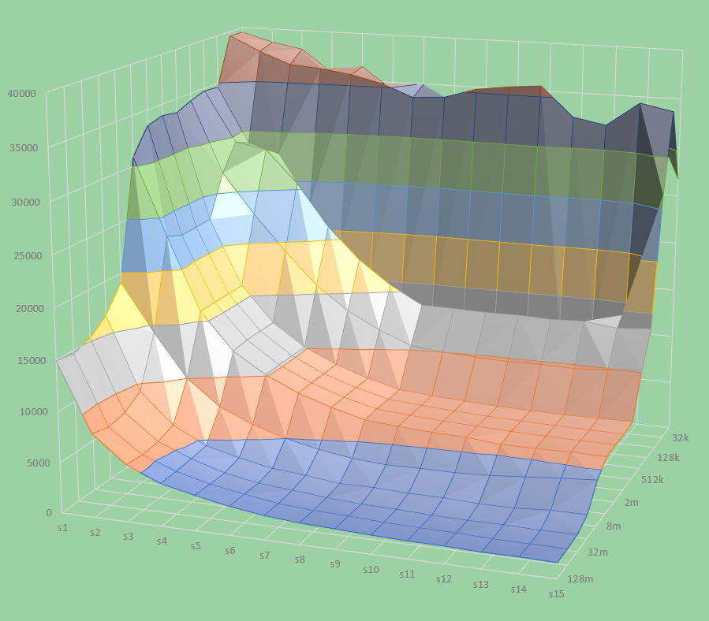

# 6.44

```shell
./moutain
Clock frequency is approx. 3672.3 MHz
Memory mountain (MB/sec)
	s1	s2	s3	s4	s5	s6	s7	s8	s9	s10	s11	s12	s13	s14	s15
128m	14933	8238	5616	4191	3468	2820	2362	2092	1969	1828	1715	1702	1581	1594	1513
64m	14698	7804	5465	4228	3386	2816	2326	2081	1975	1811	1718	1679	1562	1536	1534
32m	15266	8219	5681	4355	3348	2738	2463	2155	1941	1863	1723	1662	1680	1580	1656
16m	16615	9328	6269	4564	3745	3072	2796	2381	2401	2262	2236	2086	2078	2317	2317
8m	19055	14297	10014	7500	6030	5019	4277	3773	3538	3576	3568	3705	3975	4253	4503
4m	30891	23217	15892	12185	10100	8588	7485	6602	6323	6116	5992	5678	5655	5709	5649
2m	33426	22558	15965	12400	10146	8633	7510	6663	6389	6179	6036	5899	5816	5746	5750
1024k	33841	22672	15993	12419	10143	8598	7503	6660	6380	6183	6016	5897	5821	5757	5728
512k	33569	22705	15995	12388	10123	8632	7495	6649	6362	6179	6021	5926	5878	5876	5954
256k	34235	26888	22821	19155	15815	13420	11691	10367	10038	9825	9708	9763	9664	9913	10260
128k	34720	29526	28940	25597	21265	17995	15592	13765	13723	13620	13656	13532	13667	13264	13522
64k	34563	28795	27883	22458	18463	15878	13610	12259	11979	11990	12317	12176	12341	13807	26475
32k	39557	38056	36830	36597	36133	35369	34107	34341	35362	35804	36092	33087	32470	34931	34274
16k	39479	38568	37981	35559	36455	34100	34931	32140	30942	32870	31425	29314	28043	34100	26734

```

利用 excel 的图表功能可以得到以下图像



看起来和书上的图 6-41 差不多，所以，我估算，我的电脑的

```text
32KB  L1
256KB L2
8MB   L3
```